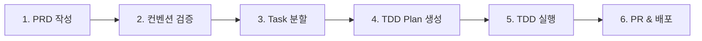
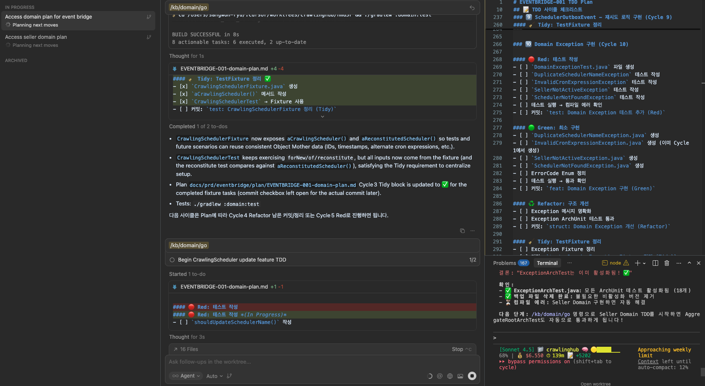

# Spring Standards Template

> **Spring Boot 3.5.x + Java 21 헥사고날 아키텍처 템플릿**
> Kent Beck TDD + Tidy First 철학 기반 엔터프라이즈 표준 프로젝트

[](https://spring.io/projects/spring-boot)
[](https://openjdk.java.net/)
[](https://alistair.cockburn.us/hexagonal-architecture/)
[](https://www.amazon.com/Test-Driven-Development-Kent-Beck/dp/0321146530)
[](https://ryu-qqq.github.io/claude-spring-standards/)

---

## 🎯 이 프로젝트는?

**Spring Boot 3.5.x + Java 21** 기반의 프로덕션 레디 헥사고날 아키텍처 템플릿입니다.

### 핵심 철학

- ✅ **Kent Beck TDD**: Red (test:) → Green (feat:) → Refactor (struct:)
- ✅ **Tidy First**: Structural과 Behavioral 변경 엄격 분리
- ✅ **Zero-Tolerance**: Lombok 금지, Law of Demeter, Long FK 전략
- ✅ **AI 도구 통합**: Claude Code + CodeRabbit + Cursor Ide
- ✅ **자동화 메트릭**: LangFuse Span 기반 TDD 사이클 추적

---

## 🚀 개발 플로우 (PRD → 구현 → 배포)

### 전체 프로세스



### 1️⃣ PRD 작성 (대화형)

```bash
# Claude Code에서 대화형으로 PRD 생성
/create-prd

# 출력 예시:
# ✅ PRD 생성 완료: docs/prd/member-management.md
# Epic: 회원 관리 시스템
# Issue Prefix: MEMBER
```

**결과물**: `docs/prd/{project-name}.md`

### 2️⃣ PRD 컨벤션 검증 및 수정 ⭐

```bash
# PRD 전체가 88개 코딩 컨벤션을 준수하는지 검증
/validate-conventions docs/prd/member-management.md

# 출력 예시:
# 🔍 전체 레이어 검증 (88개 규칙)
# ❌ 위반 사항:
#   - Domain Layer: Lombok 사용 (Line 56)
#   - Application Layer: @Transactional 내 외부 API 호출 (Line 123)
#   - Persistence Layer: JPA 관계 어노테이션 (Line 78)
#
# 📋 상세 리포트: docs/prd/member-management-validation-report.md

# 위반 사항 수정 후 재검증
/validate-conventions docs/prd/member-management.md

# ✅ 모든 규칙 통과 시 다음 단계로 진행
```

**검증 목적**:
- ✅ **전체 플로우 일관성**: 레이어 간 의존성 체크
- ✅ **아키텍처 무결성**: 헥사고날 아키텍처 원칙 준수
- ✅ **Zero-Tolerance 사전 검증**: 분할 전에 위반 사항 제거

### 3️⃣ 레이어별 Task 분할 (Breakdown)

```bash
# 검증 완료된 PRD를 헥사고날 아키텍처 5개 레이어로 분할
/breakdown-prd docs/prd/member-management.md

# 출력 예시:
# ✅ 5개 Task 생성 완료:
#   1. MEMBER-001: Domain Layer 구현
#   2. MEMBER-002: Application Layer 구현
#   3. MEMBER-003: Persistence Layer 구현
#   4. MEMBER-004: REST API Layer 구현
#   5. MEMBER-005: Integration Test
```

**결과물**: `docs/prd/tasks/MEMBER-{001-005}.md` (5개 파일)

**장점**: 이미 검증된 PRD를 분할하므로 Task 파일에 위반 사항 없음

### 4️⃣ TDD Plan 생성 (Kent Beck 사이클)

```bash
# 각 Task를 TDD 사이클 단위로 분할
/create-plan MEMBER-001

# 출력 예시:
# ✅ TDD Plan 생성 완료:
#   └─ docs/prd/plans/MEMBER-001-domain-plan.md
#
# 📊 사이클 요약:
#   - 총 사이클 수: 5
#   - 예상 소요 시간: 75분 (5 사이클 × 15분)
#   - Red → Green → Refactor → Tidy (각 5개)
```

**결과물**: `docs/prd/plans/MEMBER-001-domain-plan.md`

**Plan 구조**:
```markdown
### 1️⃣ Member Aggregate Root 설계 (Cycle 1)

#### 🔴 Red: 테스트 작성
- [ ] MemberTest.java 생성
- [ ] 커밋: test: Member Aggregate 생성 테스트 추가 (Red)

#### 🟢 Green: 최소 구현
- [ ] Member.java 생성 (Plain Java)
- [ ] 커밋: feat: Member Aggregate 구현 (Green)

#### ♻️ Refactor: 리팩토링
- [ ] 커밋: struct: Member Aggregate 개선 (Refactor)

#### 🧹 Tidy: TestFixture 정리
- [ ] 커밋: test: MemberFixture 정리 (Tidy)
```

### 5️⃣ TDD 실행 (짧은 사이클 5-15분)

#### Option A: Claude Code (`/kb` 커맨드)

```bash
# Domain Layer TDD 실행
/kb/domain/go
# → Plan 파일 읽기
# → Red: test: 커밋
# → Green: feat: 커밋
# → Refactor: struct: 커밋
# → Tidy: test: 커밋
# → Plan에 완료 표시

# 다른 레이어도 동일
/kb/application/go
/kb/persistence/go
/kb/rest-api/go
/kb/integration/go
```

#### Option B: Cursor 멀티 에이전트 (권장 🚀)

**Cursor Composer 사용**:
```
1. Cursor IDE 열기
2. Composer (Cmd+I) 열기
3. 파일 첨부: docs/prd/plans/MEMBER-001-domain-plan.md
4. 프롬프트: "이 Plan의 첫 번째 사이클을 TDD로 실행해줘"
5. Agent 모드 선택: Multi-agent (병렬 처리)
```

**장점**:
- 🚀 **5배 빠름**: 5개 파일 동시 작성 (Test, Impl, Fixture, ArchUnit, Docs)
- 🎯 **Zero-Tolerance 자동 준수**: 컨벤션 자동 적용
- 📝 **작은 커밋**: 각 Phase별 자동 커밋
- 🔄 **LangFuse 자동 업로드**: post-commit hook 자동 실행

**예시**:
```
사용자: "MEMBER-001 Plan의 Cycle 1을 실행해줘"

Cursor Composer (Multi-agent):
├─ Agent 1: MemberTest.java 작성 (Red)
├─ Agent 2: Member.java 작성 (Green)
├─ Agent 3: MemberFixture.java 작성 (Tidy)
├─ Agent 4: ArchUnit 테스트 추가 (Refactor)
└─ Agent 5: Javadoc 추가 (Refactor)

결과: 5분 만에 1개 사이클 완료 (단일 Agent는 25분)
```

### 6️⃣ 검증 및 PR

```bash
# ArchUnit 테스트
./gradlew test --tests "*ArchitectureTest"

# 전체 테스트
./gradlew test

# 메트릭 확인
tail -f ~/.claude/logs/tdd-cycle.jsonl

# LangFuse 대시보드 (환경 변수 설정 시)
# → https://cloud.langfuse.com
```

---

## 📊 타임라인 예시

| 단계 | 소요 시간 | 산출물 |
|------|-----------|--------|
| 1. PRD 작성 (`/create-prd`) | 30분 | `member-management.md` |
| 2. 컨벤션 검증 (`/validate-conventions`) | 5분 | `validation-report.md` |
| 3. Task 분할 (`/breakdown-prd`) | 5분 | 5개 Task 파일 |
| 4. TDD Plan 생성 (`/create-plan` × 5) | 10분 | 5개 Plan 파일 |
| 5. TDD 실행 (Cursor Multi-agent) | 2-4시간 | 실제 구현 코드 |
| 6. PR & 배포 | 30분 | GitHub PR |
| **총합** | **3-5시간** | **완전한 기능 구현** |

**전통적 방법 대비**:
- ❌ 전통적: 1-2주 (계획 없이 바로 코딩 → 리팩토링 지옥)
- ✅ 이 방법: 3-5시간 (Plan 기반 TDD → 한 번에 완성)

---

## 🎯 핵심 원칙

1. **Plan First**: 코드 작성 전 반드시 Plan 생성
2. **Small Cycles**: 5-15분 내 완료 가능한 작은 사이클
3. **Tidy First**: Structural과 Behavioral 절대 섞지 말 것
4. **Zero-Tolerance**: 88개 규칙 자동 검증
5. **Multi-agent**: Cursor Composer로 병렬 실행 (5배 빠름)

---

## 💾 프로젝트 설치 (초기 세팅)

### 새 프로젝트 시작

```bash
# 1. 템플릿 클론
git clone https://github.com/ryu-qqq/claude-spring-standards.git my-new-project
cd my-new-project

# 2. Git Hooks 설치 (LangFuse 메트릭 수집)
./scripts/setup-hooks.sh

# 3. 빌드 및 테스트
./gradlew clean build
```

---

## 📚 Kent Beck TDD + Tidy First 철학

### TDD 3단계

```
Red (테스트 작성) → Green (최소 구현) → Refactor (구조 개선)
         ↓                ↓                  ↓
    실패하는 테스트     테스트 통과         코드 개선
         ↓                ↓                  ↓
     test: 커밋        feat: 커밋        struct: 커밋
```

### Tidy First 핵심

**구조적 변경(Structural)**과 **동작 변경(Behavioral)**을 절대 섞지 말 것!

#### 1️⃣ Structural Changes (구조적 변경)
- **정의**: 동작을 변경하지 않고 코드 구조만 개선
- **예시**: 변수/메서드 이름 변경, 메서드 추출, 중복 제거
- **검증**: 테스트 결과가 변경 전후 동일
- **커밋**: `struct:` prefix 사용

#### 2️⃣ Behavioral Changes (동작 변경)
- **정의**: 실제 기능 추가 또는 변경
- **예시**: 새 메서드/클래스 추가, 비즈니스 로직 변경
- **커밋**: `test:` (Red) 또는 `feat:` (Green) prefix 사용

#### 3️⃣ 철칙: 절대 섞지 말 것!

```
❌ 잘못된 예:
- "feat: Add validation + rename variables" (섞음)

✅ 올바른 예:
1. struct: Rename variables → 커밋
2. test: Add validation test → 커밋
3. feat: Implement validation → 커밋
```

### 커밋 메시지 규칙

| Prefix | 용도 | Phase | 예시 |
|--------|------|-------|------|
| `test:` | 실패하는 테스트 추가 | Red | `test: Email VO 검증 테스트 추가` |
| `feat:` | 테스트 통과 구현 | Green | `feat: Email VO 구현 (RFC 5322)` |
| `struct:` | 구조 개선 (동작 동일) | Refactor | `struct: Email 검증 로직 메서드 추출` |
| `fix:` | 버그 수정 | - | `fix: Email null 처리 누락 수정` |
| `chore:` | 빌드/설정 변경 | - | `chore: Gradle 버전 업데이트` |

**핵심 원칙**:
- ✅ 한 커밋에는 하나의 타입만
- ✅ Structural과 Behavioral 절대 섞지 않기
- ✅ 작은 커밋 (1-3 파일)
- ✅ 모든 테스트 통과 시에만 커밋

---

## 📊 LangFuse 자동 메트릭 수집

### 작동 원리

```
개발자: TDD 사이클 수행
    ↓
Git Commit (test:/feat:/struct:)
    ↓
.git/hooks/post-commit (자동 트리거)
    ↓
log-to-langfuse.py (메트릭 수집)
    ├─ 커밋 타입 분류
    ├─ TDD Phase 추적
    ├─ 커밋 크기 측정
    └─ LangFuse Span 생성
         ↓
LangFuse Dashboard (분석)
    ├─ p50/p99 Duration
    ├─ TDD 사이클 시간
    ├─ Tidy First 준수율
    └─ 커밋 크기 분포
```

### 자동 추적 메트릭

- **TDD Phase**: Red/Green/Structural 자동 분류
- **커밋 크기**: 파일 수, 라인 수
- **사이클 시간**: test: → feat: 평균 시간
- **Tidy First 준수율**: Structural 분리 비율

### 설정 방법 (4가지 조건 필요)

LangFuse가 작동하려면 **다음 4가지 조건이 모두 필요**합니다:

```bash
# 1. Git Hooks 설치 (가장 중요!)
./scripts/setup-hooks.sh
# → .git/hooks/post-commit 심볼릭 링크 생성
# → 이것이 없으면 .env가 있어도 LangFuse 작동 안 함!

# 2. Python langfuse 패키지 설치
pip3 install langfuse

# 3. ~/.zshrc에 LangFuse 환경 변수 추가 (선택사항 - LangFuse Cloud 사용 시만)
echo 'export LANGFUSE_PUBLIC_KEY="pk-lf-your-public-key"' >> ~/.zshrc
echo 'export LANGFUSE_SECRET_KEY="sk-lf-your-secret-key"' >> ~/.zshrc
echo 'export LANGFUSE_HOST="https://us.cloud.langfuse.com"' >> ~/.zshrc
source ~/.zshrc
# LangFuse 계정 생성: https://cloud.langfuse.com

# 4. 테스트
git commit --allow-empty -m "test: LangFuse 테스트"
tail -1 ~/.claude/logs/tdd-cycle.jsonl
# → JSONL 로그는 항상 작동 (1번만 설치하면 됨)
# → LangFuse Cloud 업로드는 2번+3번 필요
```

**중요**: 환경 변수만 설정해도 LangFuse가 작동하지 않습니다!
→ **반드시 `./scripts/setup-hooks.sh`로 Git Hook을 먼저 설치**해야 합니다.

**대시보드**: https://cloud.langfuse.com → Traces 탭

**상세 가이드**: [LangFuse README](.claude/scripts/README-langfuse-trace.md)

### 다른 프로젝트에 설치하기

**복사할 파일 (4개)**:
```bash
# 1. TDD 추적 스크립트
cp .claude/hooks/track-tdd-cycle.sh /path/to/your-project/.claude/hooks/

# 2. Post-commit wrapper
cp .claude/hooks/post-commit /path/to/your-project/.claude/hooks/

# 3. Python 로거
cp .claude/scripts/log-to-langfuse.py /path/to/your-project/.claude/scripts/

# 4. 설치 스크립트
cp scripts/setup-hooks.sh /path/to/your-project/scripts/
```

**설치**:
```bash
cd /path/to/your-project

# 디렉토리 생성 (없을 경우)
mkdir -p .claude/hooks .claude/scripts

# 설치 스크립트 실행
./scripts/setup-hooks.sh

# 테스트
git commit --allow-empty -m "test: LangFuse test"
tail -1 ~/.claude/logs/tdd-cycle.jsonl | jq .
```

**로그 위치**: `~/.claude/logs/tdd-cycle.jsonl` (모든 프로젝트 통합)

---

## 🏗️ 아키텍처

### Hexagonal Architecture (Ports & Adapters)

```
adapter-in/          # 외부 요청 진입점
├─ rest-api/        # HTTP REST API (93개 규칙, CQRS 패턴)
│  ├─ controller/   # Command/Query Controller 분리
│  ├─ dto/          # Command/Query/Response DTO
│  ├─ mapper/       # API ↔ Application DTO 변환
│  ├─ error/        # ErrorMapper 패턴 (RFC 7807)
│  └─ config/       # Endpoint Properties
└─ ...

application/         # 비즈니스 유스케이스
├─ port/
│  ├─ in/           # UseCase 인터페이스
│  └─ out/          # Repository 인터페이스
├─ service/         # UseCase 구현
├─ facade/          # 여러 UseCase 조합
└─ assembler/       # DTO ↔ Domain 변환

domain/              # 핵심 비즈니스 로직
├─ aggregate/       # Aggregate Root
├─ vo/              # Value Object
└─ event/           # Domain Event

adapter-out/         # 외부 시스템 연동
├─ persistence-mysql/   # MySQL 영속성
├─ persistence-redis/   # Redis 캐시
└─ ...
```

### CQRS (Command/Query 분리)

```
Command (쓰기):
application/port/in/command/
application/service/command/
adapter-out/persistence/adapter/command/

Query (읽기):
application/port/in/query/
application/service/query/
adapter-out/persistence/adapter/query/
```

---

## 🚨 Zero-Tolerance 규칙

다음 규칙은 **예외 없이** 반드시 준수해야 합니다:

### 1. Lombok 금지
- ❌ `@Data`, `@Builder`, `@Getter`, `@Setter`
- ✅ **Plain Java getter/setter 직접 작성**
- **예외**: Test Fixture 모듈에서만 허용

### 2. Law of Demeter (Getter 체이닝 금지)
- ❌ `order.getCustomer().getAddress().getZipCode()`
- ✅ `order.getCustomerZipCode()` **(Tell, Don't Ask)**

### 3. Long FK Strategy (JPA 관계 금지)
- ❌ `@ManyToOne`, `@OneToMany`, `@OneToOne`, `@ManyToMany`
- ✅ **`private Long userId;` (Long FK 사용)**

### 4. Transaction 경계 & Outbox Pattern
- ❌ `@Transactional` 내 외부 API 호출
- ✅ **트랜잭션은 짧게 유지, 외부 호출은 밖에서**
- ✅ **외부 API 호출 시 Transactional Outbox Pattern 사용 (Pattern B 권장)**

### 5. Spring 프록시 제약사항
⚠️ **다음 경우 `@Transactional`이 작동하지 않습니다:**
- Private 메서드
- Final 클래스/메서드
- 같은 클래스 내부 호출 (`this.method()`)

### 6. Javadoc 필수
- ❌ `@author`, `@since` 없는 public 클래스/메서드
- ✅ **모든 public 클래스/메서드에 Javadoc**

**전체 규칙**: [코딩 컨벤션 문서](docs/coding_convention/) (88개 규칙)

---

## 🤖 AI 도구 통합

### Claude Code (비즈니스 로직, 리뷰)

### Cursor IDE (워크트리로 빠른 병렬 개발)



### CodeRabbit (PR 자동 리뷰)

- `.coderabbit.yaml` 기반 자동 리뷰
- TDD + Tidy First 준수 검증
- Commit prefix 검증
- Zero-Tolerance 규칙 검증

**통합 워크플로우**:
```
1. Claude Code → 비즈니스 로직 설계
2. Cursor IDE → tdd plans를 병렬 워크트리로 코드 생성
3. Claude Code → 복잡한 로직 구현
4. CodeRabbit → PR 리뷰
```

---

## 📖 문서

### 핵심 가이드
- **[코딩 컨벤션](docs/coding_convention/)** - 88개 상세 규칙
- **[.claude/CLAUDE.md](.claude/CLAUDE.md)** - 프로젝트 설정
- **[.coderabbit.yaml](.coderabbit.yaml)** - CodeRabbit 설정

### Layer별 가이드
- [Domain Layer](docs/coding_convention/02-domain-layer/) - 98개 규칙
- [Application Layer](docs/coding_convention/03-application-layer/) - 76개 규칙
- [Persistence Layer](docs/coding_convention/04-persistence-layer/) - 114개 규칙
- [REST API Layer](docs/coding_convention/01-adapter-in-layer/rest-api/) - 93개 규칙
  - [REST API README](adapter-in/rest-api/README.md) - 아키텍처 및 패턴 가이드
- [Testing](docs/coding_convention/05-testing/) - 3개 규칙

### 자동화
- [LangFuse Trace Guide](.claude/scripts/README-langfuse-trace.md) - Span 기반 메트릭
- [Git Post-Commit Hook](.git/hooks/post-commit) - 자동 메트릭 수집

### 모듈별 README
- **[REST API Layer README](adapter-in/rest-api/README.md)** - REST API 아키텍처, 패턴, ArchUnit 검증 (93개 규칙)
- **[Persistence MySQL README](adapter-out/persistence-mysql/README.md)** - MySQL 영속성 아키텍처, QueryDSL, ArchUnit 검증 (114개 규칙)

---

## 📊 기술 스택

| 카테고리 | 기술 |
|----------|-----------|
| **언어** | Java 21 |
| **프레임워크** | Spring Boot 3.5.x |
| **아키텍처** | Hexagonal (Ports & Adapters) |
| **설계 패턴** | DDD, CQRS |
| **ORM** | JPA + QueryDSL |
| **테스팅** | JUnit 5, Mockito, Testcontainers, ArchUnit |
| **AI 도구** | Claude Code, Cursor IDE, CodeRabbit |
| **메트릭** | LangFuse (Span 기반 TDD 추적) |

---

## 🚨 트러블슈팅

### Git Hooks가 실행되지 않음

```bash
# 1. Hooks path 확인
git config --get core.hooksPath
# → .git/hooks 여야 함

# 2. Hooks path 설정
git config core.hooksPath .git/hooks

# 3. 실행 권한 확인
chmod +x .git/hooks/post-commit

# 4. 테스트
git commit --allow-empty -m "test: Hooks 테스트"
tail -1 ~/.claude/logs/tdd-cycle.jsonl
```

### LangFuse 업로드 실패

```bash
# 1. 환경 변수 확인
cat .env

# 2. Python SDK 설치
pip3 install langfuse

# 3. 수동 테스트
python3 .claude/scripts/log-to-langfuse.py \
    --event-type "tdd_commit" \
    --project "test-project" \
    --commit-hash "abc123" \
    --commit-msg "test: Manual test" \
    --tdd-phase "red" \
    --files-changed "1 file changed" \
    --lines-changed "10 insertions" \
    --timestamp "$(date -u +%Y-%m-%dT%H:%M:%SZ)"
```

### ArchUnit 테스트 실패

```bash
# 실패 메시지 확인
./gradlew test --tests "*ArchitectureTest" --info

# 점진적 적용 (기존 코드 제외)
# → @AnalyzeClasses의 packages 범위 축소
```

---

## 📖 온라인 문서

### GitHub Pages
**URL**: https://ryu-qqq.github.io/claude-spring-standards/

온라인에서 코딩 컨벤션을 확인할 수 있습니다:
- 88개 규칙 전체
- 레이어별 가이드
- Zero-Tolerance 규칙
- 검색 및 내비게이션

### AI IDE에서 사용
```
# Cursor IDE의 Docs 기능에 추가:
https://ryu-qqq.github.io/claude-spring-standards/

```

---

## 📄 라이선스

© 2025 Ryu-qqq. All Rights Reserved.

---

## 🤝 기여

이슈와 PR은 언제나 환영합니다!

1. Fork the Project
2. Create your Feature Branch (`git checkout -b feature/AmazingFeature`)
3. **TDD 사이클 준수** (test: → feat: → struct:)
4. **Tidy First 준수** (Structural과 Behavioral 분리)
5. Commit your Changes (`git commit -m 'feat: Add some AmazingFeature'`)
6. Push to the Branch (`git push origin feature/AmazingFeature`)
7. Open a Pull Request

---

## 🔗 링크


- [Hexagonal Architecture](https://alistair.cockburn.us/hexagonal-architecture/)
- [LangFuse Documentation](https://langfuse.com/docs)
- [ArchUnit User Guide](https://www.archunit.org/userguide/html/000_Index.html)

---

*최종 업데이트: 2025-11-14 (Kent Beck TDD + Tidy First 완전 통합)*
