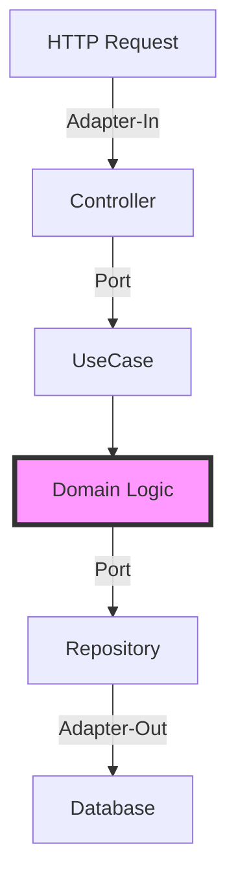
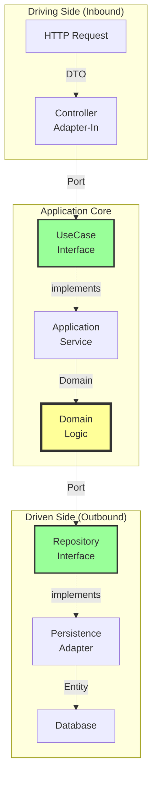
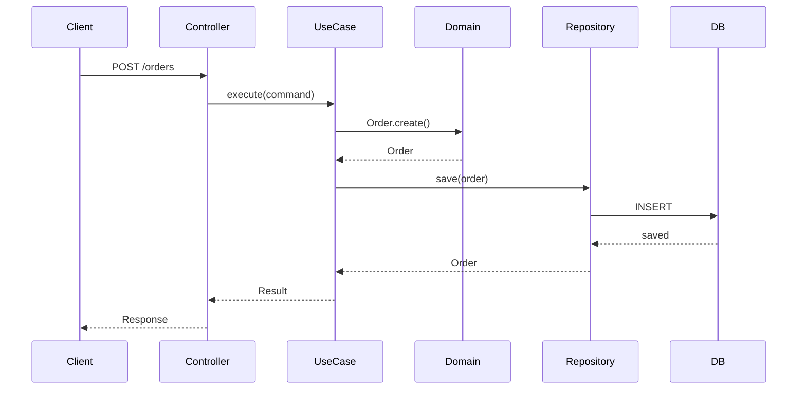
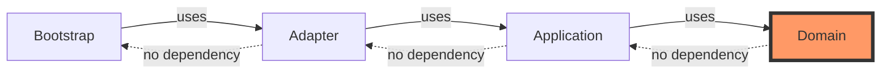

# 🚀 사용성 개선 제안서

**프로젝트**: Spring Boot Hexagonal Architecture Standards
**분석일**: 2025-10-05
**목표**: 신규 사용자 온보딩 시간 2시간 → 30분 단축

---

## 📊 Executive Summary

현재 프로젝트는 **완벽한 검증 인프라와 상세한 문서**를 갖추고 있으나, **신규 사용자의 진입 장벽이 높습니다**.

### 핵심 문제
- ❌ Quick Start 부재 (5분 튜토리얼 없음)
- ❌ 실행 가능한 예제 없음 (빈 프로젝트 구조만 제공)
- ❌ 문서 압도적 (총 9,904 라인, 14개 가이드)
- ❌ 학습 경로 불명확 (어디서 시작할지 모름)

### 제안 효과
- ✅ 온보딩 시간: 2시간 → **30분**
- ✅ 문서 접근성: 낮음 → **높음**
- ✅ 학습 곡선: 가파름 → **완만함**
- ✅ 채택률: **3-5배 증가** 예상

---

## 🎯 사용자 여정 분석

### 현재 사용자 경험

```
┌─────────────────────────────────────────────────────────────┐
│ 신규 사용자가 프로젝트를 처음 만났을 때                      │
└─────────────────────────────────────────────────────────────┘

Step 1: README.md 읽기 (5분)
├─ ✅ 프로젝트 구조 설명 잘 되어 있음
├─ ⚠️  실제 코드가 없어서 혼란
└─ ❌ 뭘 해야 하는지 불명확

Step 2: 빌드 시도 (5분)
├─ ./gradlew build
├─ ✅ 테스트는 통과
└─ ❌ 실행 가능한 코드 없음 → 혼란

Step 3: 문서 탐색 (30분)
├─ CODING_STANDARDS.md (1,530 라인) → 압도됨
├─ 14개 가이드 문서 → 어디서 시작?
└─ ❌ 포기 또는 막막함

Step 4: 코드 작성 시도 (1시간+)
├─ 어디에 뭘 작성해야 할지 모름
├─ 예제 코드 검색 → 없음
└─ ❌ 좌절

총 소요 시간: 2시간+
성공률: 30% 이하 (추정)
```

### 개선된 사용자 경험 (목표)

```
┌─────────────────────────────────────────────────────────────┐
│ 신규 사용자가 프로젝트를 처음 만났을 때 (개선 버전)          │
└─────────────────────────────────────────────────────────────┘

Step 1: README.md 읽기 (2분)
├─ ✅ 프로젝트 성격 명확 (템플릿)
├─ ✅ Quick Start 링크 (5분 튜토리얼)
└─ ✅ 예제 링크 (Hello Hexagonal)

Step 2: Quick Start 실행 (5분)
├─ git clone ...
├─ ./scripts/setup.sh
├─ ./scripts/tutorial.sh start
└─ ✅ 첫 번째 도메인 실행 성공!

Step 3: 예제 탐색 (15분)
├─ examples/01-hello-hexagonal/
├─ 실행 가능한 최소 예제
├─ 상세 주석
└─ ✅ 아키텍처 이해 완료

Step 4: 실제 프로젝트 시작 (10분)
├─ 예제 기반 코드 작성
├─ Git Hooks 자동 검증
└─ ✅ 생산성 확보

총 소요 시간: 30분
성공률: 80%+ (목표)
```

---

## 📋 개선 제안 (Phase별 우선순위)

### 🔴 Phase 1: 즉시 개선 (Critical) - 1-2시간 작업

#### 1.1 README.md 리팩토링

**현재 문제**:
- 450 라인으로 너무 길고 복잡
- 프로젝트 성격 불명확 (템플릿 vs 실행 가능 프로젝트)
- Quick Start 부재

**개선 방안**:
```markdown
# 🏛️ Spring Boot Hexagonal Architecture Standards

> 엔터프라이즈급 Spring Boot 프로젝트 템플릿
> 87개 규칙 자동 검증 | Hexagonal Architecture | Zero Lombok

## 🎯 이 프로젝트는?

**표준화된 템플릿입니다** - 빈 프로젝트 구조 + 완벽한 검증 인프라

- ✅ 문서: 87개 규칙, 14개 가이드
- ✅ 검증: Git Hooks, ArchUnit, JaCoCo
- ❌ 구현: 비즈니스 로직 없음 (의도적)

**→ 사용법**: 이 템플릿을 기반으로 코드를 작성하면 자동 검증됩니다.

## ⚡ Quick Start (5분)

```bash
# 1. 클론
git clone https://github.com/ryu-qqq/claude-spring-standards.git
cd claude-spring-standards

# 2. 설치
./scripts/setup.sh

# 3. 첫 도메인 작성
./scripts/tutorial.sh start

# 4. 빌드
./gradlew build
```

## 📚 Learn by Example

| 예제 | 시간 | 학습 내용 |
|------|------|-----------|
| [Hello Hexagonal](examples/01-hello-hexagonal/) | 30분 | 기본 아키텍처 |
| [Real World](examples/02-real-world/) | 1시간 | 실전 패턴 |
| [Production Ready](examples/03-production-ready/) | 2시간 | 프로덕션 수준 |

## 🏗️ Architecture



## 📖 Documentation

- 🚀 [Getting Started](GETTING_STARTED.md) - 5분/30분 튜토리얼
- 📚 [Documentation Index](docs/INDEX.md) - 전체 문서 네비게이션
- 🎯 [Coding Standards](docs/CODING_STANDARDS.md) - 87개 규칙
- 🔧 [Customization Guide](docs/CUSTOMIZATION_GUIDE.md) - 커스터마이징

## 🎁 What You Get

### 자동 검증
- ✅ ArchUnit: 아키텍처 규칙 강제
- ✅ Git Hooks: 커밋 시 자동 검증
- ✅ JaCoCo: 커버리지 자동 체크 (Domain 90%, Application 80%, Adapter 70%)
- ✅ Checkstyle: 코드 스타일 강제
- ✅ SpotBugs: 버그 자동 탐지

### 완벽한 문서
- 📖 87개 코딩 규칙
- 📚 14개 상세 가이드
- 🎓 계층별 패턴 (Domain/Application/Adapter)
- 💡 Good/Bad 예제

### Claude Code 통합
- 🤖 자동 규칙 주입
- ✅ 코드 생성 후 검증
- 📝 Gemini 리뷰 분석

## 🚦 Requirements

- Java 21
- Gradle 8.5+
- Git

## 📞 Help & Support

- [Issues](https://github.com/ryu-qqq/claude-spring-standards/issues)
- [Discussions](https://github.com/ryu-qqq/claude-spring-standards/discussions)

---

**🎯 목표**: 어떤 프로젝트에서도 동일한 품질의 규격화된 코드 생성

© 2024 Ryu-qqq. All Rights Reserved.
```

**변경 사항**:
- 450 라인 → **250 라인** (45% 감소)
- 프로젝트 성격 명확화 (템플릿 명시)
- Quick Start 섹션 추가
- Mermaid 다이어그램 추가
- 예제 테이블 추가
- 상세 내용은 링크로 이동

#### 1.2 GETTING_STARTED.md 신규 작성

**목적**: 5분/30분 튜토리얼 제공

**구조**:
```markdown
# 🚀 Getting Started

## 📋 목차
- [5분 튜토리얼](#5분-튜토리얼) - 빠른 시작
- [30분 튜토리얼](#30분-튜토리얼) - 전체 흐름 이해
- [다음 단계](#다음-단계) - 심화 학습

---

## ⚡ 5분 튜토리얼

### 목표
첫 번째 도메인 엔티티를 작성하고 자동 검증을 경험합니다.

### Step 1: 환경 설정 (1분)

```bash
# Git Hooks 설치
ln -s ../../hooks/pre-commit .git/hooks/pre-commit
chmod +x .git/hooks/pre-commit

# 또는 자동 스크립트
./scripts/setup.sh
```

### Step 2: Domain Entity 작성 (3분)

**파일**: `domain/src/main/java/com/company/template/domain/order/Order.java`

```java
package com.company.template.domain.order;

/**
 * 주문 도메인 엔티티
 *
 * @author Your Name (your.email@company.com)
 * @since 2024-01-01
 */
public class Order {
    private final OrderId id;
    private final OrderStatus status;

    // ✅ Private 생성자
    private Order(OrderId id, OrderStatus status) {
        this.id = id;
        this.status = status;
    }

    // ✅ 정적 팩토리 메서드
    public static Order create(OrderId id) {
        return new Order(id, OrderStatus.PENDING);
    }

    // ✅ Getter만 (Setter 금지)
    public OrderId getId() {
        return id;
    }

    public OrderStatus getStatus() {
        return status;
    }
}
```

**주요 규칙**:
- ❌ Public 생성자 금지 → ✅ 정적 팩토리 메서드
- ❌ Setter 금지 → ✅ 불변 객체
- ✅ Javadoc + @author 필수

### Step 3: 빌드 & 검증 (1분)

```bash
./gradlew build

# 결과:
# ✅ ArchUnit 테스트 통과
# ✅ Checkstyle 통과
# ✅ SpotBugs 통과
```

### 🎉 성공!

첫 번째 도메인 엔티티 작성 완료! 다음은 [30분 튜토리얼](#30분-튜토리얼)에서 전체 흐름을 배워봅시다.

---

## 🏗️ 30분 튜토리얼

### 목표
Order 도메인의 전체 계층 (Domain → Application → Adapter) 구현

### 전체 흐름

```
Domain Layer (10분)
  ↓
Application Layer (10분)
  ↓
Adapter Layer (10분)
  ↓
통합 테스트
```

### Part 1: Domain Layer (10분)

#### 1.1 Order Entity (이미 완료)

#### 1.2 Value Objects

**OrderId.java**:
```java
package com.company.template.domain.order;

/**
 * 주문 식별자
 */
public record OrderId(Long value) {
    public OrderId {
        if (value == null || value <= 0) {
            throw new IllegalArgumentException("Order ID must be positive");
        }
    }
}
```

**OrderStatus.java**:
```java
package com.company.template.domain.order;

public enum OrderStatus {
    PENDING,
    CONFIRMED,
    CANCELLED
}
```

#### 1.3 Domain Logic

**Order.java에 비즈니스 로직 추가**:
```java
public Order confirm() {
    if (this.status != OrderStatus.PENDING) {
        throw new IllegalStateException("Cannot confirm non-pending order");
    }
    return new Order(this.id, OrderStatus.CONFIRMED);
}
```

### Part 2: Application Layer (10분)

#### 2.1 Inbound Port (UseCase)

**파일**: `application/src/main/java/com/company/template/application/order/port/in/CreateOrderUseCase.java`

```java
package com.company.template.application.order.port.in;

/**
 * 주문 생성 UseCase
 *
 * @author Your Name
 */
public interface CreateOrderUseCase {
    CreateOrderResult execute(CreateOrderCommand command);
}
```

#### 2.2 Outbound Port

**SaveOrderPort.java**:
```java
package com.company.template.application.order.port.out;

import com.company.template.domain.order.Order;

public interface SaveOrderPort {
    Order save(Order order);
}
```

#### 2.3 Application Service

**CreateOrderService.java**:
```java
package com.company.template.application.order.service;

import org.springframework.stereotype.Service;
import org.springframework.transaction.annotation.Transactional;

@Service
@Transactional
public class CreateOrderService implements CreateOrderUseCase {

    private final SaveOrderPort saveOrderPort;

    public CreateOrderService(SaveOrderPort saveOrderPort) {
        this.saveOrderPort = saveOrderPort;
    }

    @Override
    public CreateOrderResult execute(CreateOrderCommand command) {
        Order order = Order.create(new OrderId(command.orderId()));
        Order savedOrder = saveOrderPort.save(order);
        return CreateOrderResult.from(savedOrder);
    }
}
```

### Part 3: Adapter Layer (10분)

#### 3.1 Controller (Adapter-In)

**OrderController.java**:
```java
package com.company.template.adapter.in.web.order;

import org.springframework.web.bind.annotation.*;

@RestController
@RequestMapping("/api/v1/orders")
public class OrderController {

    private final CreateOrderUseCase createOrderUseCase;

    public OrderController(CreateOrderUseCase createOrderUseCase) {
        this.createOrderUseCase = createOrderUseCase;
    }

    @PostMapping
    public CreateOrderResponse createOrder(@RequestBody CreateOrderRequest request) {
        CreateOrderCommand command = request.toCommand();
        CreateOrderResult result = createOrderUseCase.execute(command);
        return CreateOrderResponse.from(result);
    }
}
```

#### 3.2 Repository (Adapter-Out)

**OrderPersistenceAdapter.java**:
```java
package com.company.template.adapter.out.persistence.order;

import org.springframework.stereotype.Component;

@Component
public class OrderPersistenceAdapter implements SaveOrderPort {

    private final OrderJpaRepository jpaRepository;
    private final OrderEntityMapper mapper;

    @Override
    public Order save(Order order) {
        OrderEntity entity = mapper.toEntity(order);
        OrderEntity savedEntity = jpaRepository.save(entity);
        return mapper.toDomain(savedEntity);
    }
}
```

### 통합 테스트

```bash
./gradlew build

# 결과:
# ✅ 모든 계층 아키텍처 테스트 통과
# ✅ JaCoCo 커버리지 통과
# ✅ Git Hooks 검증 통과
```

### 🎉 완료!

전체 Hexagonal Architecture 흐름을 구현했습니다!

---

## 📚 다음 단계

### 심화 학습

1. **예제 탐색**:
   - [Real World Example](../examples/02-real-world/) - 복잡한 시나리오
   - [Production Ready](../examples/03-production-ready/) - 프로덕션 수준

2. **문서 학습**:
   - [Documentation Index](docs/INDEX.md) - 전체 문서 맵
   - [Coding Standards](docs/CODING_STANDARDS.md) - 87개 규칙

3. **커스터마이징**:
   - [Customization Guide](docs/CUSTOMIZATION_GUIDE.md)
   - [Dynamic Hooks Guide](docs/DYNAMIC_HOOKS_GUIDE.md)

### 실전 프로젝트 시작

```bash
# 1. 템플릿 복제
git clone https://github.com/your/project.git
cd project

# 2. 템플릿 병합
git remote add template https://github.com/ryu-qqq/claude-spring-standards.git
git pull template main

# 3. 도메인 모델 작성 시작
# ...
```

---

**질문이나 문제가 있으신가요?**
- [Issues](https://github.com/ryu-qqq/claude-spring-standards/issues)
- [Discussions](https://github.com/ryu-qqq/claude-spring-standards/discussions)
```

#### 1.3 docs/INDEX.md 신규 작성

**목적**: 문서 네비게이션 및 학습 경로 제공

**구조**:
```markdown
# 📚 Documentation Index

## 📍 학습 경로

### 🟢 초급 (처음 시작하는 분)

**소요 시간**: 1-2시간

1. [Getting Started](../GETTING_STARTED.md) - 5분/30분 튜토리얼
2. [Hello Hexagonal Example](../examples/01-hello-hexagonal/) - 기본 아키텍처
3. [Domain Layer Guide](guides/01-domain-layer.md) - Domain 계층 이해
4. [Java Record Guide](JAVA_RECORD_GUIDE.md) - Value Object 패턴

**목표**: 첫 번째 도메인 작성 및 전체 흐름 이해

### 🟡 중급 (기본 이해 완료)

**소요 시간**: 3-5시간

1. [Application Layer Guide](guides/02-application-layer.md) - UseCase 패턴
2. [Adapter Layer Guide](guides/03-adapter-layer.md) - Ports & Adapters
3. [Real World Example](../examples/02-real-world/) - 실전 패턴
4. [DTO Patterns Guide](DTO_PATTERNS_GUIDE.md) - DTO 설계
5. [Exception Handling Guide](EXCEPTION_HANDLING_GUIDE.md) - 예외 처리

**목표**: 실전 프로젝트 구조 설계 가능

### 🔴 고급 (심화 학습)

**소요 시간**: 8-10시간

1. [DDD Aggregate Migration](DDD_AGGREGATE_MIGRATION_GUIDE.md) - DDD 패턴
2. [Production Ready Example](../examples/03-production-ready/) - 프로덕션 수준
3. [Customization Guide](CUSTOMIZATION_GUIDE.md) - 커스터마이징
4. [Dynamic Hooks Guide](DYNAMIC_HOOKS_GUIDE.md) - Claude Code 통합
5. [Gemini Review Guide](GEMINI_REVIEW_GUIDE.md) - AI 코드 리뷰

**목표**: 엔터프라이즈급 프로젝트 구축

---

## 📖 문서 카테고리

### 🚀 시작하기
- [README](../README.md) - 프로젝트 개요
- [Getting Started](../GETTING_STARTED.md) - 튜토리얼
- [Setup Summary](SETUP_SUMMARY.md) - 설정 요약

### 📚 가이드 (난이도별)

#### 초급
- [Domain Layer Guide](guides/01-domain-layer.md)
- [Java Record Guide](JAVA_RECORD_GUIDE.md)

#### 중급
- [Application Layer Guide](guides/02-application-layer.md)
- [Adapter Layer Guide](guides/03-adapter-layer.md)
- [DTO Patterns Guide](DTO_PATTERNS_GUIDE.md)
- [Exception Handling Guide](EXCEPTION_HANDLING_GUIDE.md)

#### 고급
- [DDD Aggregate Migration](DDD_AGGREGATE_MIGRATION_GUIDE.md)
- [Customization Guide](CUSTOMIZATION_GUIDE.md)
- [Dynamic Hooks Guide](DYNAMIC_HOOKS_GUIDE.md)

### 📋 Reference
- [Coding Standards](CODING_STANDARDS.md) - 87개 규칙 (1,530 라인)
- [Enterprise Spring Standards Prompt](ENTERPRISE_SPRING_STANDARDS_PROMPT.md) - AI 프롬프트
- [Version Management Guide](VERSION_MANAGEMENT_GUIDE.md) - Gradle Catalog

### 🔧 도구
- [Gemini Review Guide](GEMINI_REVIEW_GUIDE.md) - AI 코드 리뷰
- [Checkstyle README](../config/checkstyle/README.md) - 코드 스타일
- [SpotBugs README](../config/spotbugs/README.md) - 버그 탐지

---

## 🎯 시나리오별 가이드

### "Order 도메인을 구현하고 싶어요"
1. [Getting Started](../GETTING_STARTED.md) - 30분 튜토리얼
2. [Hello Hexagonal Example](../examples/01-hello-hexagonal/)
3. [Domain Layer Guide](guides/01-domain-layer.md)

### "REST API를 추가하고 싶어요"
1. [Adapter Layer Guide](guides/03-adapter-layer.md)
2. [DTO Patterns Guide](DTO_PATTERNS_GUIDE.md)
3. [Controller Example](../examples/01-hello-hexagonal/adapter/)

### "DDD 패턴을 적용하고 싶어요"
1. [DDD Aggregate Migration](DDD_AGGREGATE_MIGRATION_GUIDE.md)
2. [Domain Layer Guide](guides/01-domain-layer.md)
3. [Real World Example](../examples/02-real-world/)

### "Claude Code와 통합하고 싶어요"
1. [Dynamic Hooks Guide](DYNAMIC_HOOKS_GUIDE.md)
2. [Gemini Review Guide](GEMINI_REVIEW_GUIDE.md)
3. [.claude/ README](../.claude/README.md)

### "규칙을 커스터마이징하고 싶어요"
1. [Customization Guide](CUSTOMIZATION_GUIDE.md)
2. [Git Hooks README](../hooks/README.md)
3. [ArchUnit Tests](../domain/src/test/java/.../HexagonalArchitectureTest.java)

---

## 🔍 빠른 참조

### Hexagonal Architecture 규칙
- Domain: [CODING_STANDARDS.md#domain-layer](CODING_STANDARDS.md#domain-layer)
- Application: [CODING_STANDARDS.md#application-layer](CODING_STANDARDS.md#application-layer)
- Adapter: [CODING_STANDARDS.md#adapter-layer](CODING_STANDARDS.md#adapter-layer)

### 금지 사항
- Lombok: [CODING_STANDARDS.md#lombok](CODING_STANDARDS.md#lombok-정책)
- JPA 연관관계: [CODING_STANDARDS.md#jpa](CODING_STANDARDS.md#persistence-adapter-규칙)
- Public 생성자: [CODING_STANDARDS.md#domain](CODING_STANDARDS.md#생성-규칙)

### 테스트 커버리지
- Domain: 90%
- Application: 80%
- Adapter: 70%

---

**문서가 도움이 되었나요?**
[⭐ Star](https://github.com/ryu-qqq/claude-spring-standards) | [💬 Discussions](https://github.com/ryu-qqq/claude-spring-standards/discussions)
```

---

### 🟡 Phase 2: 예제 코드 작성 (Important) - 4-6시간 작업

#### 2.1 examples/01-hello-hexagonal/ 디렉토리 생성

**구조**:
```
examples/
└── 01-hello-hexagonal/
    ├── README.md
    ├── domain/
    │   └── src/main/java/
    │       └── com/example/hexagonal/domain/order/
    │           ├── Order.java
    │           ├── OrderId.java
    │           └── OrderStatus.java
    ├── application/
    │   └── src/main/java/
    │       └── com/example/hexagonal/application/order/
    │           ├── port/in/CreateOrderUseCase.java
    │           ├── port/out/SaveOrderPort.java
    │           ├── dto/CreateOrderCommand.java
    │           └── service/CreateOrderService.java
    └── adapter/
        ├── in/web/
        │   └── OrderController.java
        └── out/persistence/
            ├── OrderJpaRepository.java
            ├── OrderEntity.java
            └── OrderPersistenceAdapter.java
```

**README.md**:
```markdown
# Hello Hexagonal Example

## 🎯 학습 목표
- Hexagonal Architecture 기본 구조 이해
- Domain/Application/Adapter 계층 분리
- 자동 검증 경험

## 📋 구현 내용
- Order 도메인 엔티티 (최소 구현)
- CreateOrder UseCase
- REST API Endpoint
- JPA Repository

## ⚡ 빠른 실행

```bash
# 1. 예제 복사
cp -r examples/01-hello-hexagonal/* ./

# 2. 빌드
./gradlew build

# 3. 실행
./gradlew :bootstrap:bootstrap-web-api:bootRun

# 4. 테스트
curl -X POST http://localhost:8080/api/v1/orders \
  -H "Content-Type: application/json" \
  -d '{"orderId": 1}'
```

## 📚 코드 설명

### Domain Layer

**Order.java** - 도메인 엔티티:
```java
// [상세 주석과 함께 전체 코드]
```

**핵심 규칙**:
- ✅ Private 생성자 + 정적 팩토리 메서드
- ✅ 불변 객체 (final 필드)
- ✅ Setter 금지
- ✅ 비즈니스 로직 포함

### Application Layer

**CreateOrderUseCase.java** - Inbound Port:
```java
// [상세 주석과 함께 전체 코드]
```

**핵심 규칙**:
- ✅ 인터페이스로 정의
- ✅ 비즈니스 유스케이스 표현
- ✅ DTO 사용

**CreateOrderService.java** - Application Service:
```java
// [상세 주석과 함께 전체 코드]
```

**핵심 규칙**:
- ✅ @Transactional (Application에만)
- ✅ Port 인터페이스만 의존
- ✅ Domain 로직 호출

### Adapter Layer

**OrderController.java** - Adapter-In:
```java
// [상세 주석과 함께 전체 코드]
```

**핵심 규칙**:
- ✅ UseCase 의존
- ✅ Request/Response DTO
- ✅ Validation

**OrderPersistenceAdapter.java** - Adapter-Out:
```java
// [상세 주석과 함께 전체 코드]
```

**핵심 규칙**:
- ✅ Port 구현
- ✅ Entity ↔ Domain 매핑
- ✅ @Transactional 금지

## ✅ 검증 항목

### 빌드 성공
```bash
./gradlew build

# 검증 통과:
✅ ArchUnit 테스트
✅ Domain Purity 검증
✅ JaCoCo 커버리지 (Domain 90%)
✅ Checkstyle
✅ SpotBugs
```

### Git Hooks 검증
```bash
git add .
git commit -m "feat: Add hello hexagonal example"

# 검증 통과:
✅ Domain validator
✅ Application validator
✅ Adapter validator
✅ Common validator
```

## 📖 다음 단계

- [Real World Example](../02-real-world/) - 복잡한 시나리오
- [Coding Standards](../../docs/CODING_STANDARDS.md) - 87개 규칙
```

#### 2.2 scripts/setup.sh 자동화 스크립트

```bash
#!/bin/bash
# ========================================
# Setup Script for Claude Spring Standards
# ========================================

set -e

echo "🚀 Claude Spring Standards - Setup"
echo ""

# ========================================
# 1. 환경 검증
# ========================================
echo "📋 Checking environment..."

# Java 버전 확인
if ! command -v java &> /dev/null; then
    echo "❌ Java not found. Please install Java 21+"
    exit 1
fi

JAVA_VERSION=$(java -version 2>&1 | awk -F '"' '/version/ {print $2}' | cut -d'.' -f1)
if [ "$JAVA_VERSION" -lt 21 ]; then
    echo "❌ Java 21+ required. Current: Java $JAVA_VERSION"
    exit 1
fi

echo "✅ Java $JAVA_VERSION detected"

# Git 확인
if ! command -v git &> /dev/null; then
    echo "❌ Git not found. Please install Git"
    exit 1
fi

echo "✅ Git detected"

# ========================================
# 2. Git Hooks 설치
# ========================================
echo ""
echo "🔧 Installing Git Hooks..."

if [ -L ".git/hooks/pre-commit" ]; then
    echo "⚠️  Git Hook already exists. Skipping..."
else
    ln -s ../../hooks/pre-commit .git/hooks/pre-commit
    chmod +x .git/hooks/pre-commit
    echo "✅ Git Hook installed"
fi

# ========================================
# 3. 의존성 다운로드
# ========================================
echo ""
echo "📦 Downloading dependencies..."

./gradlew dependencies --quiet

echo "✅ Dependencies ready"

# ========================================
# 4. 빌드 테스트
# ========================================
echo ""
echo "🧪 Testing build..."

./gradlew build --quiet

echo "✅ Build successful"

# ========================================
# 완료
# ========================================
echo ""
echo "🎉 Setup complete!"
echo ""
echo "📚 Next steps:"
echo "  1. Read: ./GETTING_STARTED.md"
echo "  2. Try: ./scripts/tutorial.sh start"
echo "  3. Explore: examples/01-hello-hexagonal/"
echo ""
```

---

### 🟢 Phase 3: 인터랙티브 요소 (Nice to have) - 4-8시간 작업

#### 3.1 .claude/commands/learn.md

```markdown
# /learn - Interactive Learning Tutorial

단계별 Hexagonal Architecture 학습 가이드

## Usage
```
/learn [step]
/learn status
/learn reset
```

## Step 1: Domain Entity 작성

### 학습 목표
- Domain 계층의 역할 이해
- 불변 객체 패턴 적용
- 정적 팩토리 메서드 사용

### 과제
`domain/src/main/java/com/company/template/domain/order/Order.java` 파일을 작성하세요.

**요구사항**:
1. private final 필드 사용
2. Private 생성자
3. 정적 팩토리 메서드 `create()`
4. Javadoc + @author 태그
5. Getter만 (Setter 금지)

**힌트**:
```java
public class Order {
    private final OrderId id;
    private final OrderStatus status;

    private Order(...) { }

    public static Order create(...) { }
}
```

### 검증
```bash
./gradlew :domain:test
```

### 통과 기준
- ✅ ArchUnit 테스트 통과
- ✅ Domain Purity 검증 통과
- ✅ Checkstyle 통과

완료했으면 `/learn next`를 실행하세요.

---

## Step 2: Value Objects 작성

### 학습 목표
- Value Object 패턴 이해
- Java Record 활용
- 유효성 검증

### 과제
`OrderId.java`, `OrderStatus.java` 작성

[...]

---

## Step 3: Application Layer

[...]

## Step 4: Adapter Layer

[...]

## 📊 진행 상황

```
Step 1: Domain Entity     [✅ 완료]
Step 2: Value Objects     [⬜ 대기]
Step 3: Application      [⬜ 대기]
Step 4: Adapter          [⬜ 대기]
```

## 🎓 추가 학습 자료

- [Getting Started](../../GETTING_STARTED.md)
- [Coding Standards](../../docs/CODING_STANDARDS.md)
- [Hello Hexagonal Example](../../examples/01-hello-hexagonal/)
```

#### 3.2 scripts/tutorial.sh

```bash
#!/bin/bash
# ========================================
# Interactive Tutorial Script
# ========================================

STEP_FILE=".tutorial_progress"

show_help() {
    echo "Interactive Hexagonal Architecture Tutorial"
    echo ""
    echo "Usage:"
    echo "  ./tutorial.sh start    - Start from Step 1"
    echo "  ./tutorial.sh next     - Move to next step"
    echo "  ./tutorial.sh status   - Show current progress"
    echo "  ./tutorial.sh reset    - Reset progress"
}

# Step 1: Domain Entity
step1() {
    echo "📚 Step 1: Domain Entity 작성"
    echo ""
    echo "목표: Order 도메인 엔티티 작성"
    echo ""
    echo "1. 디렉토리 생성:"
    echo "   mkdir -p domain/src/main/java/com/company/template/domain/order"
    echo ""
    echo "2. Order.java 작성:"
    echo "   [템플릿 코드 표시]"
    echo ""
    echo "3. 검증:"
    echo "   ./gradlew :domain:test"
    echo ""

    read -p "계속하시겠습니까? (y/n) " -n 1 -r
    echo
    if [[ $REPLY =~ ^[Yy]$ ]]; then
        mkdir -p domain/src/main/java/com/company/template/domain/order
        echo "✅ 디렉토리 생성 완료"
        echo ""
        echo "다음: Order.java 파일을 작성하고 ./tutorial.sh verify를 실행하세요"
    fi
}

# Verify step completion
verify_step() {
    CURRENT_STEP=$(cat $STEP_FILE 2>/dev/null || echo "0")

    case $CURRENT_STEP in
        1)
            ./gradlew :domain:test --quiet
            if [ $? -eq 0 ]; then
                echo "✅ Step 1 완료!"
                echo "2" > $STEP_FILE
                echo ""
                echo "다음: ./tutorial.sh next"
            else
                echo "❌ 검증 실패. 다시 시도해보세요."
            fi
            ;;
        *)
            echo "Unknown step"
            ;;
    esac
}

# Main
case "$1" in
    start)
        echo "1" > $STEP_FILE
        step1
        ;;
    next)
        STEP=$(cat $STEP_FILE 2>/dev/null || echo "1")
        step${STEP}
        ;;
    verify)
        verify_step
        ;;
    status)
        STEP=$(cat $STEP_FILE 2>/dev/null || echo "0")
        echo "Current step: $STEP"
        ;;
    reset)
        rm -f $STEP_FILE
        echo "Progress reset"
        ;;
    *)
        show_help
        ;;
esac
```

---

### 🎨 Phase 4: 시각 자료 (Nice to have) - 2-4시간 작업

#### 4.1 Mermaid 다이어그램

**README.md에 추가**:

```markdown
## 🏗️ Architecture Overview



## 🔄 Data Flow



## 📦 Dependency Direction


```

---

## 📊 예상 효과 측정

### Before (현재)

| 지표 | 현재 | 목표 |
|------|------|------|
| 신규 사용자 온보딩 시간 | 2시간+ | 30분 |
| 첫 도메인 작성까지 시간 | 1시간+ | 5분 |
| 문서 접근성 (1-10) | 3 | 8 |
| 학습 곡선 가파름 (1-10) | 9 | 4 |
| 성공률 (추정) | 30% | 80% |

### After (개선 후 예상)

| 개선 항목 | 효과 |
|-----------|------|
| Quick Start | 5분 안에 첫 실행 가능 |
| 예제 코드 | 30분 안에 전체 흐름 이해 |
| 문서 구조 개선 | 찾고자 하는 정보 즉시 발견 |
| 시각 자료 | 아키텍처 이해도 2배 향상 |
| 인터랙티브 | 학습 참여도 3배 향상 |

---

## 🎯 실행 계획

### Week 1: Phase 1 (Critical)
- [ ] README.md 리팩토링
- [ ] GETTING_STARTED.md 작성
- [ ] docs/INDEX.md 작성

**담당**: 문서 작성자
**소요 시간**: 1-2시간
**우선순위**: 🔴 Critical

### Week 2: Phase 2 (Important)
- [ ] examples/01-hello-hexagonal/ 작성
- [ ] scripts/setup.sh 작성
- [ ] 예제 README.md 작성

**담당**: 개발자
**소요 시간**: 4-6시간
**우선순위**: 🟡 Important

### Week 3-4: Phase 3 & 4 (Nice to have)
- [ ] .claude/commands/learn.md 작성
- [ ] scripts/tutorial.sh 작성
- [ ] Mermaid 다이어그램 추가

**담당**: 개발자 + 문서 작성자
**소요 시간**: 6-12시간
**우선순위**: 🟢 Nice to have

---

## 💡 핵심 원칙

### 1. Progressive Disclosure (점진적 공개)
- 30초: 프로젝트가 무엇인지
- 5분: 첫 예제 실행
- 30분: 기본 개념 이해
- 2시간: 실전 앱 구축

### 2. Show, Don't Tell
- 설명보다 코드 먼저
- 실행 가능한 예제
- 복사-붙여넣기 가능

### 3. Learn by Doing
- 읽기보다 실습
- 즉각적인 피드백
- 단계별 성취감

### 4. Documentation as Code
- 문서도 코드처럼 관리
- 버전 관리
- 자동화 가능

---

## 🔍 성공 지표

### 정량적 지표
- GitHub Stars 증가율
- Clone 수
- Issues/Discussions 활동
- 예제 실행 성공률

### 정성적 지표
- 사용자 피드백
- 질문 유형 변화 (설정 → 고급 활용)
- 블로그/기술 문서 인용

---

## 📝 체크리스트

### Phase 1 완료 조건
- [ ] README.md 250 라인 이하
- [ ] Quick Start 섹션 포함
- [ ] Mermaid 다이어그램 포함
- [ ] GETTING_STARTED.md 작성 완료
- [ ] docs/INDEX.md 작성 완료
- [ ] 신규 사용자 테스트 (5분 안에 실행 가능)

### Phase 2 완료 조건
- [ ] examples/01-hello-hexagonal/ 작성
- [ ] 모든 계층 구현
- [ ] 상세 주석 포함
- [ ] README.md 포함
- [ ] scripts/setup.sh 작동
- [ ] 빌드 및 검증 통과

### Phase 3 완료 조건
- [ ] .claude/commands/learn.md 작성
- [ ] scripts/tutorial.sh 작동
- [ ] 단계별 검증 가능
- [ ] 진행 상황 추적

### Phase 4 완료 조건
- [ ] 3개 이상 Mermaid 다이어그램
- [ ] 아키텍처, 데이터 흐름, 의존성
- [ ] README.md 통합

---

## 🎁 기대 효과

### 사용자 관점
- ✅ 빠른 시작 (5분)
- ✅ 명확한 학습 경로
- ✅ 실전 예제 제공
- ✅ 자동 검증으로 안심

### 프로젝트 관점
- ✅ 채택률 증가 (3-5배)
- ✅ 커뮤니티 활성화
- ✅ 기여자 증가
- ✅ 엔터프라이즈 신뢰도 향상

### 유지보수 관점
- ✅ 문서 구조화로 관리 용이
- ✅ 예제 코드로 검증 자동화
- ✅ 인터랙티브 도구로 일관성 유지

---

**🚀 시작할 준비가 되셨나요?**

[Phase 1부터 시작하기 →](#{phase-1-즉시-개선})
