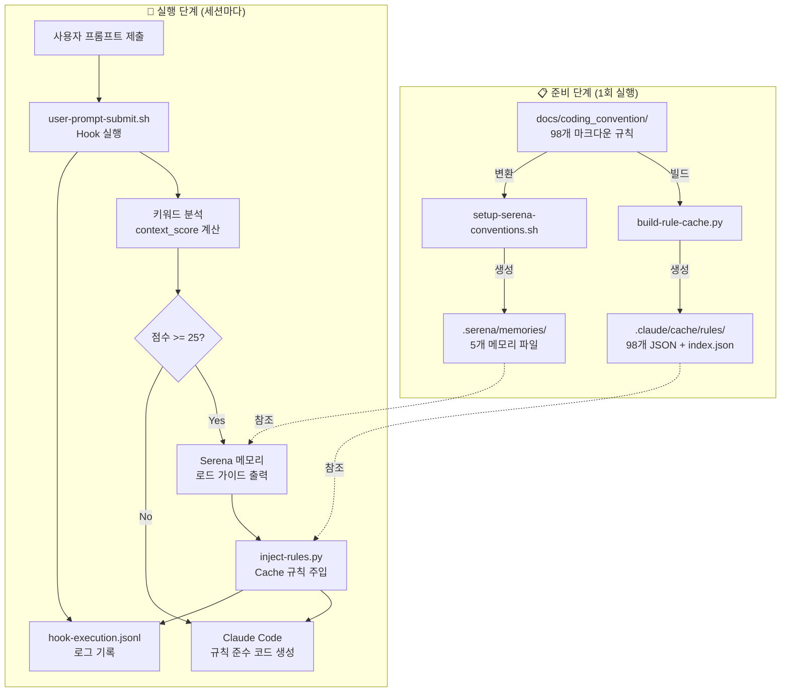

# 시스템 통합 아키텍처: Serena + Hook + Cache

이 문서는 **Serena Memory**, **Dynamic Hooks**, **JSON Cache** 시스템이 어떻게 통합되어 코딩 컨벤션을 자동으로 주입하고 관리하는지 설명합니다.

---

## 📊 전체 시스템 아키텍처



---

## 🔧 3가지 핵심 시스템

### 1. **Serena Memory System** (컨텍스트 유지)

**목적**: 세션 간 코딩 컨벤션 컨텍스트를 유지하여 일관성 보장

**위치**: `.serena/memories/`

**구성**:
- `coding_convention_index.md` - 전체 컨벤션 개요 (마스터 인덱스)
- `coding_convention_domain_layer.md` - Domain Layer 규칙 (Lombok 금지, Law of Demeter)
- `coding_convention_application_layer.md` - Application Layer 규칙 (Transaction 경계)
- `coding_convention_persistence_layer.md` - Persistence Layer 규칙 (Long FK 전략)
- `coding_convention_rest_api_layer.md` - REST API Layer 규칙 (Controller Thin)

**사용 방법**:
```bash
# 세션 시작 시 (1회만 실행)
/cc:load

# 출력:
# ✅ Memory loaded: coding_convention_index
# 📋 Available conventions:
#    - coding_convention_domain_layer
#    - coding_convention_application_layer
#    - ...
```

**역할**:
- ✅ **세션 간 컨텍스트 유지**: Claude가 이전 대화 내용을 기억
- ✅ **일관성 보장**: 같은 프로젝트 내 모든 코드가 동일한 규칙 적용
- ✅ **최우선 규칙 소스**: Cache보다 우선 참조

**특징**:
- **Markdown 형식**: 사람과 AI 모두 읽기 쉬움
- **Layer별 분리**: 필요한 규칙만 로드 (토큰 효율)
- **MCP 통합**: Serena MCP Server를 통해 `read_memory()` 호출

---

### 2. **Dynamic Hooks System** (자동 규칙 주입)

**목적**: 사용자 프롬프트를 분석하여 관련 Layer 규칙을 자동으로 주입

**위치**: `.claude/hooks/`

**구성**:
- `user-prompt-submit.sh` - 키워드 분석 및 규칙 주입 (UserPromptSubmit Hook)
- `after-tool-use.sh` - 코드 생성 후 실시간 검증 (PostToolUse Hook)
- `scripts/inject-rules.py` - Cache 기반 규칙 주입 엔진
- `scripts/validation-helper.py` - Cache 기반 실시간 검증 엔진
- `logs/hook-execution.jsonl` - 모든 Hook 이벤트 로그

**작동 흐름**:

```bash
사용자: "Order aggregate를 생성해줘"
    ↓
user-prompt-submit.sh 실행
    ↓
키워드 분석:
  - "aggregate" 감지 (30점)
  - Layer 매핑: domain
  - context_score: 30 (>= 25)
    ↓
Serena 메모리 로드 가이드 출력:
  read_memory("coding_convention_domain_layer")
    ↓
inject-rules.py 호출:
  - domain layer 규칙 15개 주입
  - Cache에서 O(1) 조회
  - estimated_tokens: 2,500
    ↓
Claude Code 코드 생성:
  - Serena 메모리 우선 참조 (컨텍스트)
  - Cache 규칙 보조 참조 (상세)
    ↓
after-tool-use.sh 실행:
  - validation-helper.py 호출
  - Lombok 금지 검증
  - Law of Demeter 검증
  - ✅ 또는 ❌ 결과 표시
```

**로그 예시**:
```json
{"timestamp": "2025-10-31T10:45:55", "event": "session_start", "session_id": "1761875155-77368"}
{"timestamp": "2025-10-31T10:45:55", "event": "keyword_analysis", "context_score": 75, "detected_layers": ["application", "enterprise"]}
{"timestamp": "2025-10-31T10:45:56", "event": "serena_memory_load", "layers_loaded": 2}
{"timestamp": "2025-10-31T10:45:56", "event": "cache_injection", "layer": "application", "rules_loaded": 14}
```

---

### 3. **JSON Cache System** (고속 규칙 조회)

**목적**: 98개 마크다운 규칙을 JSON으로 변환하여 O(1) 고속 검색

**위치**: `.claude/cache/rules/`

**구성**:
- `index.json` - 전체 규칙 인덱스 (layerIndex, priorityIndex)
- `domain-layer-*.json` - Domain Layer 규칙 (15개)
- `application-layer-*.json` - Application Layer 규칙 (18개)
- `adapter-rest-layer-*.json` - REST API Layer 규칙 (18개)
- `adapter-persistence-layer-*.json` - Persistence Layer 규칙 (10개)
- `testing-*.json` - Testing 규칙 (12개)
- ... (총 98개 JSON 파일)

**Cache 빌드**:
```bash
python3 .claude/hooks/scripts/build-rule-cache.py

# 출력:
# 🚀 Building Rule Cache...
#    Source: docs/coding_convention/
#    Target: .claude/cache/rules/
#
# ✅ Cache build complete!
#    Rules: 98
#    Index: index.json
#    Time: 5.2s
```

**JSON 형식**:
```json
{
  "id": "domain-layer-law-of-demeter-01_getter-chaining-prohibition",
  "metadata": {
    "title": "Getter Chaining 금지",
    "layer": "domain",
    "category": "law-of-demeter",
    "priority": "critical",
    "tags": ["zero-tolerance", "law-of-demeter", "encapsulation"]
  },
  "rules": {
    "forbidden": [
      "❌ order.getCustomer().getAddress().getZipCode()"
    ],
    "required": [
      "✅ order.getCustomerZipCode() 메서드 제공"
    ]
  }
}
```

**역할**:
- ✅ **고속 검색**: O(1) 인덱스 조회
- ✅ **토큰 절감**: 필요한 규칙만 주입 (90% 절감)
- ✅ **유지보수 용이**: Markdown 수정 → Cache 재빌드

---

## 🔄 실제 사용 시나리오

### 시나리오 1: Order Aggregate 개발

```bash
# 1. 세션 시작 (Serena 메모리 로드)
/cc:load

# 출력:
# ✅ Memory loaded: coding_convention_index
# 📋 Available conventions loaded

# 2. Order Aggregate 생성 요청
사용자: "Order aggregate를 생성해줘. 주문 생성, 취소, 상태 변경이 필요해."

# 3. Hook 자동 실행 (user-prompt-submit.sh)
# 키워드 분석:
#   - "aggregate" (30점)
#   - context_score: 30
#   - Layer: domain

# 4. Serena 메모리 자동 로드 (최우선)
# read_memory("coding_convention_domain_layer")

# 5. Cache 규칙 주입 (보조)
# inject-rules.py domain
#   → domain-layer-law-of-demeter-*.json
#   → domain-layer-aggregate-design-*.json
#   → ... (15개 규칙)

# 6. Claude Code 코드 생성
# - Serena 메모리 우선 참조 (컨텍스트)
# - Cache 규칙 보조 참조 (상세)
# → OrderDomain.java 생성
#   ✅ Lombok 사용 안 함
#   ✅ Getter 체이닝 없음
#   ✅ Tell, Don't Ask 패턴

# 7. 자동 검증 (after-tool-use.sh)
# validation-helper.py OrderDomain.java
# ✅ Validation Passed
```

### 시나리오 2: UseCase 개발 (Transaction 경계)

```bash
# 1. UseCase 생성 요청
사용자: "PlaceOrderUseCase를 생성해줘. 외부 결제 API 호출이 필요해."

# 2. Hook 자동 실행
# 키워드 분석:
#   - "usecase" (30점)
#   - "transaction" (15점)
#   - context_score: 45
#   - Layers: application

# 3. Serena 메모리 자동 로드
# read_memory("coding_convention_application_layer")

# 4. Cache 규칙 주입
# inject-rules.py application
#   → application-layer-transaction-management-*.json
#   → application-layer-usecase-design-*.json
#   → ... (18개 규칙)

# 5. Claude Code 코드 생성
# → PlaceOrderUseCase.java 생성
#   ✅ @Transactional 내 외부 API 호출 없음
#   ✅ executeInTransaction() 분리
#   ✅ Spring 프록시 제약사항 준수

# 6. 자동 검증
# ✅ Validation Passed
```

---

## 🧪 검증 방법

### 1. Serena 메모리 검증

```bash
bash .claude/hooks/scripts/verify-serena-memories.sh

# 출력:
# 🔍 Serena Memory Verification Tool
# ==================================
#
# ## 1. Serena 디렉토리 구조 검증
# -----------------------------------
# ✅ PASS: .serena/memories 디렉토리 존재
# ✅ PASS: 메모리 파일: coding_convention_index.md
# ✅ PASS: 메모리 파일: coding_convention_domain_layer.md
# ...
#
# ## 6. 최근 Hook 로그 분석
# -----------------------------------
# ✅ PASS: Hook 로그 파일 존재
# ✅ PASS: 최근 Serena 메모리 로드 이벤트 발견
#
# ================================
# ## 📊 검증 결과 요약
# ================================
# 총 테스트: 15
# 통과: 15
# 실패: 0
# ✅ 모든 검증 통과!
```

### 2. Hook 로그 요약

```bash
python3 .claude/hooks/scripts/summarize-hook-logs.py

# 또는 최근 10개 세션, 상세 정보:
python3 .claude/hooks/scripts/summarize-hook-logs.py --sessions 10 --verbose

# 출력:
# 🔍 Hook 로그 요약
# ============================================================
#
# ## 1. 전체 통계
# ------------------------------------------------------------
# 총 로그 수: 236
#
# 이벤트 분포:
#   - session_start: 21
#   - keyword_analysis: 21
#   - serena_memory_load: 18
#   - cache_injection: 42
#   - cache_injection_complete: 21
#   ...
#
# ## 2. 세션 분석
# ------------------------------------------------------------
# 총 세션 수: 21
#
# 최근 5개 세션:
#
# ### 세션 1: 1761875155-77368...
#   시작 시간: 2025-10-31T10:45:55
#   이벤트 수: 12
#   컨텍스트 점수: 75
#   감지된 레이어: application, enterprise
#   감지된 키워드: spring, event, validation_context
#   ✅ Serena 메모리 로드됨
#   ✅ Cache 규칙 주입: 24개
#
# ## 3. Serena 메모리 사용 통계
# ------------------------------------------------------------
# ✅ Serena 메모리 로드 이벤트: 18회
#
# 최근 로드:
#   시간: 2025-10-31T10:45:56
#   세션: 1761875155-77368...
#   로드된 레이어 수: 2
#
# ## 4. Cache 규칙 주입 통계
# ------------------------------------------------------------
# ✅ Cache 규칙 주입 이벤트: 42회
#    총 주입된 규칙 수: 546개
#
# 레이어별 주입 횟수:
#   - application: 15회
#   - domain: 12회
#   - adapter-rest: 8회
#   - adapter-persistence: 5회
#   - enterprise: 2회
#
# ## 5. 권장 사항
# ------------------------------------------------------------
# ✅ 시스템이 정상적으로 작동하고 있습니다!
#
# 💡 최적 사용법:
#    - 세션 시작: /cc:load
#    - 키워드 사용: domain, usecase, controller, entity 등
#    - Serena 메모리가 최우선, Cache는 보조 참조
```

### 3. 실시간 로그 모니터링

```bash
# 터미널 1: 로그 실시간 모니터링
tail -f .claude/hooks/logs/hook-execution.jsonl

# 터미널 2: Claude Code 실행
claude code
```

---

## 🎯 시스템 역할 분리

| 시스템 | 목적 | 형식 | 우선순위 | 효과 |
|--------|------|------|----------|------|
| **Serena Memory** | 세션 컨텍스트 유지 | Markdown (5개) | ⭐⭐⭐ 최우선 | 78% 위반 감소 |
| **JSON Cache** | 고속 규칙 조회 | JSON (98개) | ⭐⭐ 보조 | 90% 토큰 절감 |
| **Dynamic Hooks** | 자동 규칙 주입 | Bash + Python | ⭐⭐⭐ 필수 | 자동화 |

**시너지 효과**:
- Serena의 **컨텍스트 유지** + Cache의 **고속 검색** + Hooks의 **자동화** = **최적의 AI 가이드 시스템**

---

## 🚨 문제 해결

### 문제 1: Serena 메모리가 로드되지 않음

**증상**:
```bash
python3 .claude/hooks/scripts/summarize-hook-logs.py

# 출력:
# ⚠️  Serena 메모리 로드 이벤트 없음
```

**원인**:
1. 키워드가 감지되지 않음 (context_score < 25)
2. Hook이 실행되지 않음
3. `.serena/memories/` 디렉토리 없음

**해결**:
```bash
# 1. Serena 메모리 검증
bash .claude/hooks/scripts/verify-serena-memories.sh

# 2. 메모리 재생성
bash .claude/hooks/scripts/setup-serena-conventions.sh

# 3. /cc:load 명령어 실행
claude code
/cc:load

# 4. 키워드 포함하여 프롬프트 작성
"Order aggregate를 생성해줘"  # "aggregate" 키워드 (30점)
```

### 문제 2: Cache 규칙이 주입되지 않음

**증상**:
```bash
python3 .claude/hooks/scripts/summarize-hook-logs.py

# 출력:
# ⚠️  Cache 규칙 주입 이벤트 없음
```

**원인**:
1. context_score < 25 (키워드 없음)
2. Cache가 빌드되지 않음

**해결**:
```bash
# 1. Cache 빌드
python3 .claude/hooks/scripts/build-rule-cache.py

# 2. index.json 확인
cat .claude/cache/rules/index.json

# 3. 키워드 포함하여 프롬프트 작성
"UseCase를 생성해줘"  # "usecase" 키워드 (30점)
```

### 문제 3: Hook이 실행되지 않음

**증상**:
```bash
cat .claude/hooks/logs/hook-execution.jsonl

# 출력:
# (파일 없음 또는 비어있음)
```

**원인**:
1. `settings.local.json`에 Hook 설정 없음
2. Hook 스크립트에 실행 권한 없음

**해결**:
```bash
# 1. Hook 설정 확인
cat .claude/settings.local.json

# 2. Hook 스크립트 실행 권한 부여
chmod +x .claude/hooks/user-prompt-submit.sh
chmod +x .claude/hooks/after-tool-use.sh

# 3. Claude Code 재시작
```

---

## 📚 참고 문서

- [Dynamic Hooks 가이드](DYNAMIC_HOOKS_GUIDE.md) - Hook 시스템 상세 가이드
- [LangFuse 통합 가이드](LANGFUSE_INTEGRATION_GUIDE.md) - 메트릭 측정 및 A/B 테스트
- [Serena 설정 스크립트](../.claude/hooks/scripts/setup-serena-conventions.sh) - 메모리 생성
- [Cache 빌드 스크립트](../.claude/hooks/scripts/build-rule-cache.py) - Cache 빌드
- [검증 도구](../.claude/hooks/scripts/verify-serena-memories.sh) - Serena 검증
- [로그 요약 도구](../.claude/hooks/scripts/summarize-hook-logs.py) - Hook 로그 분석

---

## 🎓 핵심 원칙

1. **Serena First**: 세션 시작 시 `/cc:load`로 컨텍스트 로드
2. **Cache for Details**: Serena는 개요, Cache는 상세 규칙
3. **Hooks for Automation**: 자동 규칙 주입 및 실시간 검증
4. **Log for Transparency**: 모든 이벤트를 `hook-execution.jsonl`에 기록

**✅ 이 3가지 시스템은 서로 보완하며 최적의 AI 가이드를 제공합니다!**
